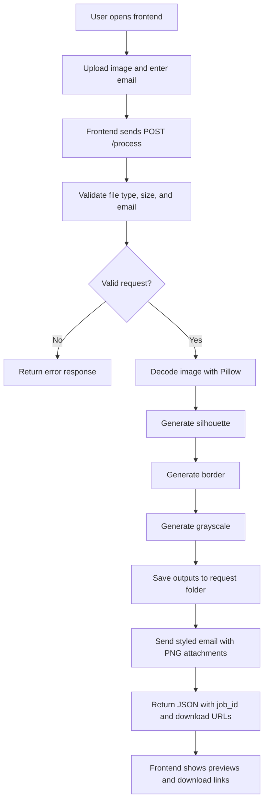

# Morphix

Morphix is a full-stack logo processing application that accepts a logo upload, generates three computer-vision outputs, and automatically emails the results as PNG attachments.

The project was built to satisfy the assignment requirement of an end-to-end system with:

- modular backend architecture
- real CV processing using Python libraries
- automatic email delivery after processing
- a frontend that triggers the workflow and previews results

## Project Overview

Morphix takes a single uploaded image and creates:

- `silhouette.png`
- `border.png`
- `grayscale.png`

After the backend finishes processing, it sends all three files to the recipient email address and also exposes download links for the frontend preview screen.

## Demo Video

Loom walkthrough:

https://www.loom.com/share/d14c44aafa864919be7965cb0e290ddc

## Key Features

- Uploads PNG, JPG, and JPEG images up to 5 MB
- Generates silhouette, edge/border, and grayscale outputs programmatically
- Sends all generated outputs through SMTP email automatically
- Uses request-scoped storage so each processed upload gets its own output set
- Returns API download URLs for frontend preview and download
- Includes frontend previews for all generated outputs
- Uses a modular FastAPI backend instead of a monolithic single file
- Includes a mobile-friendly frontend with a bottom navigation dock

## Tech Stack

### Backend

- Python
- FastAPI
- OpenCV
- Pillow
- NumPy
- SMTP via Python `smtplib`

### Frontend

- React
- Vite
- Tailwind CSS
- Framer Motion
- React Icons

## Backend Architecture

The assignment specifically asked for code quality and modularity, so the backend was refactored into separate responsibilities.

### Route Layer

- `app/api/routes/process.py`
  Handles `POST /process`, validates inputs, calls processing services, stores output files, and triggers email sending.

- `app/api/routes/download.py`
  Handles output downloads using either a request-specific `job_id` route or a backward-compatible latest-output route.

- `app/api/routes/health.py`
  Provides root and health endpoints.

### Service Layer

- `app/services/image_service.py`
  Loads images and performs the three required CV transformations.

- `app/services/storage_service.py`
  Stores generated outputs inside a unique request directory and returns file paths plus `job_id`.

- `app/services/email_service.py`
  Sends a styled HTML email with a plain-text fallback and attaches all generated PNG files.

### Utility and Config Layer

- `app/utils/validators.py`
  Validates upload type, file size, and recipient email.

- `app/core/config.py`
  Loads configuration from environment variables and `Backend/.env`.

- `app/core/constants.py`
  Stores allowed image types and supported output names.

- `app/schemas/responses.py`
  Defines the response model for the processing endpoint.

## How The Project Works

### End-to-End Workflow

1. User opens the frontend.
2. User uploads a logo image and enters a recipient email.
3. Frontend sends a `POST /process` request with multipart form data.
4. Backend validates the file type, size, and email.
5. Backend decodes the image using Pillow.
6. Backend runs:
   - silhouette transformation
   - edge/border transformation
   - grayscale transformation
7. Backend stores the generated outputs in a request-specific directory.
8. Backend sends all generated PNG files through SMTP email.
9. Backend returns JSON containing:
   - processing status
   - email status
   - `job_id`
   - output download URLs
10. Frontend renders previews and download links for all generated outputs.

## Flowchart



## CV Processing Details

### 1. Silhouette

Purpose:
Create a solid filled version of the main logo shape.

Implementation:

- If the image has transparency, the alpha channel is thresholded
- If the image is RGB, a luminance threshold is used
- Morphological closing helps fill internal gaps
- Final result is saved as black shape on white background

### 2. Border

Purpose:
Extract only the visible edges and strokes of the logo.

Implementation:

- Convert image to grayscale
- Apply Gaussian blur to reduce noise
- Run Canny edge detection
- Render edges as black lines on white background

### 3. Grayscale

Purpose:
Create a grayscale version of the original image.

Implementation:

- Convert image with Pillow using luminance-based grayscale conversion
- Preserve alpha channel when present
- Save result as PNG

## Email Workflow

After processing, the backend sends a branded HTML email with:

- project title and summary
- a styled description of each generated output
- all output files attached as `.png`
- plain-text fallback for clients that do not render HTML

If email delivery fails, processing still succeeds and the frontend can still preview and download outputs manually.

## API Reference

### `GET /`

Health root endpoint.

Example response:

```json
{
  "status": "ok",
  "service": "Morphix API"
}
```

### `GET /health`

Additional health endpoint.

### `POST /process`

Accepts multipart form data.

#### Form Fields

- `image`
  Required image file
- `recipient_email`
  Optional email that overrides `RECIPIENT_EMAIL` from environment variables

#### Successful Response

```json
{
  "job_id": "abc123",
  "silhouette": "generated",
  "border": "generated",
  "grayscale": "generated",
  "email_status": "sent",
  "recipient_email": "you@example.com",
  "downloads": {
    "silhouette": "/download/abc123/silhouette",
    "border": "/download/abc123/border",
    "grayscale": "/download/abc123/grayscale"
  }
}
```

### `GET /download/{job_id}/{output}`

Downloads the exact output created for a specific processing job.

Supported output names:

- `silhouette`
- `border`
- `grayscale`

### `GET /download/{output}`

Returns the latest generated version for backward compatibility.

## Error Handling

### `400 Bad Request`

- unsupported file type
- empty upload
- invalid recipient email

### `413 Payload Too Large`

- uploaded file exceeds 5 MB

### `422 Unprocessable Entity`

- image cannot be decoded properly

### `500 Internal Server Error`

- image processing failure
- output save failure

Email failure is handled gracefully and returned inside `email_status` without failing the whole request.

## Environment Variables

Create `Backend/.env` from `Backend/.env.example`.

| Variable | Description | Example |
|----------|-------------|---------|
| `SMTP_HOST` | SMTP server host | `smtp.gmail.com` |
| `SMTP_PORT` | SMTP server port | `587` |
| `SMTP_USER` | sender email account | `you@gmail.com` |
| `SMTP_PASSWORD` | app password or SMTP password | `abcd efgh ijkl mnop` |
| `RECIPIENT_EMAIL` | fallback recipient email | `team@example.com` |
| `CORS_ORIGINS` | comma-separated allowed frontend origins | `http://localhost:5173,http://127.0.0.1:5173` |

## Setup Instructions

### Backend Setup

```bash
cd Backend
python -m venv venv
venv\Scripts\activate
pip install -r requirements.txt
copy .env.example .env
```

Fill `Backend/.env` with your SMTP credentials.

Run backend:

```bash
uvicorn main:app --reload --port 8000
```

Backend URLs:

- API: `http://localhost:8000`
- Swagger docs: `http://localhost:8000/docs`

### Frontend Setup

```bash
cd Frontend
npm install
npm run dev
```

Frontend URL:

- `http://localhost:5173`

Frontend routes:

- `/`
- `/transform`
- `/about`

## Frontend Notes

The frontend includes:

- upload area with drag and drop
- email input
- loading state during processing
- output preview cards
- output download links
- responsive navigation

On mobile screens, the navigation is fixed at the bottom for easier one-hand usage.

## Why This Structure Is Better

Compared to a single-file backend, this modular structure gives:

- clearer separation of concerns
- easier debugging
- easier testing
- safer extension for future features
- better readability for reviewers

## Local Verification Completed

The project was verified locally with:

- backend route loading check
- backend processing smoke test with generated sample PNG
- frontend production build using `npm run build`

## Future Improvements

- inline image thumbnails embedded directly inside the email body
- output history page by `job_id`
- persistent database storage
- authentication for private processing history
- Docker support for one-command project startup
