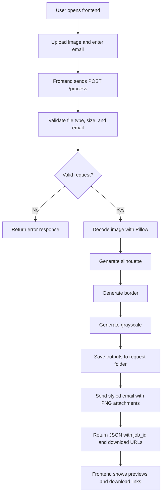

# Morphix

Morphix is a full-stack logo processing application that accepts a logo upload, generates three computer-vision outputs, and automatically emails the results as PNG attachments.

The project was built to satisfy the assignment requirement of an end-to-end system with:

- modular backend architecture
- real CV processing using Python libraries
- automatic email delivery after processing
- a frontend that triggers the workflow and previews results

## Project Overview

Morphix takes a single uploaded image and creates:

- `silhouette.png`
- `border.png`
- `grayscale.png`

After the backend finishes processing, it sends all three files to the recipient email address and also exposes download links for the frontend preview screen.

## Key Features

- Uploads PNG, JPG, and JPEG images up to 5 MB
- Generates silhouette, edge/border, and grayscale outputs programmatically
- Sends all generated outputs through SMTP email automatically
- Uses request-scoped storage so each processed upload gets its own output set
- Returns API download URLs for frontend preview and download
- Includes frontend previews for all generated outputs
- Uses a modular FastAPI backend instead of a monolithic single file
- Includes a mobile-friendly frontend with a bottom navigation dock

## Tech Stack

### Backend

- Python 3.11+
- FastAPI
- OpenCV
- Pillow
- NumPy
- SMTP via Python `smtplib`

### Frontend

- React 18
- Vite
- Tailwind CSS
- Framer Motion
- React Icons

## Folder Structure

```text
Morphix/
|-- Backend/
|   |-- app/
|   |   |-- api/
|   |   |   |-- routes/
|   |   |   |   |-- download.py
|   |   |   |   |-- health.py
|   |   |   |   `-- process.py
|   |   |   `-- router.py
|   |   |-- core/
|   |   |   |-- config.py
|   |   |   `-- constants.py
|   |   |-- schemas/
|   |   |   `-- responses.py
|   |   |-- services/
|   |   |   |-- email_service.py
|   |   |   |-- image_service.py
|   |   |   `-- storage_service.py
|   |   |-- utils/
|   |   |   `-- validators.py
|   |   |-- __init__.py
|   |   `-- main.py
|   |-- .env.example
|   |-- main.py
|   `-- requirements.txt
|-- Frontend/
|   |-- src/
|   |   |-- components/
|   |   |   `-- Navbar.jsx
|   |   |-- config/
|   |   |   `-- api.js
|   |   |-- pages/
|   |   |   |-- AboutPage.jsx
|   |   |   |-- LandingPage.jsx
|   |   |   `-- ProcessPage.jsx
|   |   |-- App.jsx
|   |   |-- index.css
|   |   `-- main.jsx
|   |-- package.json
|   `-- vite.config.js
`-- README.md
```

## Backend Architecture

The assignment specifically asked for code quality and modularity, so the backend was refactored into separate responsibilities.

### Route Layer

- `app/api/routes/process.py`
  Handles `POST /process`, validates inputs, calls processing services, stores output files, and triggers email sending.

- `app/api/routes/download.py`
  Handles output downloads using either a request-specific `job_id` route or a backward-compatible latest-output route.

- `app/api/routes/health.py`
  Provides root and health endpoints.

### Service Layer

- `app/services/image_service.py`
  Loads images and performs the three required CV transformations.

- `app/services/storage_service.py`
  Stores generated outputs inside a unique request directory and returns file paths plus `job_id`.

- `app/services/email_service.py`
  Sends a styled HTML email with a plain-text fallback and attaches all generated PNG files.

### Utility and Config Layer

- `app/utils/validators.py`
  Validates upload type, file size, and recipient email.

- `app/core/config.py`
  Loads configuration from environment variables and `Backend/.env`.

- `app/core/constants.py`
  Stores allowed image types and supported output names.

- `app/schemas/responses.py`
  Defines the response model for the processing endpoint.

## How The Project Works

### End-to-End Workflow

1. User opens the frontend.
2. User uploads a logo image and enters a recipient email.
3. Frontend sends a `POST /process` request with multipart form data.
4. Backend validates the file type, size, and email.
5. Backend decodes the image using Pillow.
6. Backend runs:
   - silhouette transformation
   - edge/border transformation
   - grayscale transformation
7. Backend stores the generated outputs in a request-specific directory.
8. Backend sends all generated PNG files through SMTP email.
9. Backend returns JSON containing:
   - processing status
   - email status
   - `job_id`
   - output download URLs
10. Frontend renders previews and download links for all generated outputs.

## Flowchart



## CV Processing Details

### 1. Silhouette

Purpose:
Create a solid filled version of the main logo shape.

Implementation:

- If the image has transparency, the alpha channel is thresholded
- If the image is RGB, a luminance threshold is used
- Morphological closing helps fill internal gaps
- Final result is saved as black shape on white background

### 2. Border

Purpose:
Extract only the visible edges and strokes of the logo.

Implementation:

- Convert image to grayscale
- Apply Gaussian blur to reduce noise
- Run Canny edge detection
- Render edges as black lines on white background

### 3. Grayscale

Purpose:
Create a grayscale version of the original image.

Implementation:

- Convert image with Pillow using luminance-based grayscale conversion
- Preserve alpha channel when present
- Save result as PNG

## Email Workflow

After processing, the backend sends a branded HTML email with:

- project title and summary
- a styled description of each generated output
- all output files attached as `.png`
- plain-text fallback for clients that do not render HTML

If email delivery fails, processing still succeeds and the frontend can still preview and download outputs manually.

## API Reference

### `GET /`

Health root endpoint.

Example response:

```json
{
  "status": "ok",
  "service": "Morphix API"
}
```

### `GET /health`

Additional health endpoint.

### `POST /process`

Accepts multipart form data.

#### Form Fields

- `image`
  Required image file
- `recipient_email`
  Optional email that overrides `RECIPIENT_EMAIL` from environment variables

#### Successful Response

```json
{
  "job_id": "abc123",
  "silhouette": "generated",
  "border": "generated",
  "grayscale": "generated",
  "email_status": "sent",
  "recipient_email": "you@example.com",
  "downloads": {
    "silhouette": "/download/abc123/silhouette",
    "border": "/download/abc123/border",
    "grayscale": "/download/abc123/grayscale"
  }
}
```

### `GET /download/{job_id}/{output}`

Downloads the exact output created for a specific processing job.

Supported output names:

- `silhouette`
- `border`
- `grayscale`

### `GET /download/{output}`

Returns the latest generated version for backward compatibility.

## Error Handling

### `400 Bad Request`

- unsupported file type
- empty upload
- invalid recipient email

### `413 Payload Too Large`

- uploaded file exceeds 5 MB

### `422 Unprocessable Entity`

- image cannot be decoded properly

### `500 Internal Server Error`

- image processing failure
- output save failure

Email failure is handled gracefully and returned inside `email_status` without failing the whole request.

## Environment Variables

Create `Backend/.env` from `Backend/.env.example`.

| Variable | Description | Example |
|----------|-------------|---------|
| `SMTP_HOST` | SMTP server host | `smtp.gmail.com` |
| `SMTP_PORT` | SMTP server port | `587` |
| `SMTP_USER` | sender email account | `you@gmail.com` |
| `SMTP_PASSWORD` | app password or SMTP password | `abcd efgh ijkl mnop` |
| `RECIPIENT_EMAIL` | fallback recipient email | `team@example.com` |
| `CORS_ORIGINS` | comma-separated allowed frontend origins | `http://localhost:5173,http://127.0.0.1:5173` |

## Setup Instructions

### Backend Setup

```bash
cd Backend
python -m venv venv
venv\Scripts\activate
pip install -r requirements.txt
copy .env.example .env
```

Fill `Backend/.env` with your SMTP credentials.

Run backend:

```bash
uvicorn main:app --reload --port 8000
```

Backend URLs:

- API: `http://localhost:8000`
- Swagger docs: `http://localhost:8000/docs`

### Frontend Setup

```bash
cd Frontend
npm install
npm run dev
```

Frontend URL:

- `http://localhost:5173`

Frontend routes:

- `/`
- `/transform`
- `/about`

## Deployment Recommendation

Use this hosting split:

- Backend: Render
- Frontend: Vercel

Why this is the best fit for this project:

- Render is very straightforward for FastAPI and supports the exact `uvicorn` start command this backend needs.
- Vercel is excellent for Vite frontend deployment and handles static assets and preview deployments very well.
- This split keeps backend and frontend deployment simple and easy to explain in your assignment.

## Deployment Files Added

The repo is now prepared with:

- `render.yaml`
  Render Blueprint for backend deployment
- `Frontend/vercel.json`
  SPA rewrite config so direct routes like `/about` and `/transform` work on Vercel
- `Frontend/.env.example`
  frontend environment variable example for the live API URL

## Deploy Backend on Render

Official Render FastAPI docs say a FastAPI service should use:

- build command: `pip install -r requirements.txt`
- start command: `uvicorn main:app --host 0.0.0.0 --port $PORT`

Source:

- Render FastAPI docs: https://render.com/docs/deploy-fastapi
- Render Blueprint docs: https://render.com/docs/blueprint-spec

### Option 1: Deploy Using `render.yaml`

1. Push this project to GitHub.
2. Go to Render dashboard.
3. Click `New +` -> `Blueprint`.
4. Connect your GitHub repository.
5. Render will detect the root-level `render.yaml`.
6. Review the service config and create the service.

The backend service is configured as:

- `rootDir: Backend`
- `buildCommand: pip install -r requirements.txt`
- `startCommand: uvicorn main:app --host 0.0.0.0 --port $PORT`
- `healthCheckPath: /health`

### Option 2: Deploy Manually in Render Dashboard

If you do not want to use `render.yaml`, create a new Web Service with:

- Runtime: `Python 3`
- Root Directory: `Backend`
- Build Command: `pip install -r requirements.txt`
- Start Command: `uvicorn main:app --host 0.0.0.0 --port $PORT`

### Render Environment Variables

Add these in Render:

- `SMTP_HOST=smtp.gmail.com`
- `SMTP_PORT=587`
- `SMTP_USER=your-email@gmail.com`
- `SMTP_PASSWORD=your-gmail-app-password`
- `RECIPIENT_EMAIL=optional-default-recipient@example.com`
- `CORS_ORIGINS=https://your-frontend-domain.vercel.app`

If you later add a custom frontend domain, update `CORS_ORIGINS` to that domain too.

### Backend Deploy Check

After deployment:

1. Open your backend URL
2. Visit `/health`
3. Visit `/docs`
4. Confirm the API loads correctly

Example:

- `https://your-backend-name.onrender.com/health`
- `https://your-backend-name.onrender.com/docs`

## Deploy Frontend on Vercel

Official Vercel docs for Vite note:

- Vite apps can be deployed directly on Vercel
- environment variables used in Vite must be prefixed with `VITE_`
- SPA deep linking needs a `vercel.json` rewrite to `index.html`

Source:

- Vercel Vite docs: https://examples.vercel.com/docs/frameworks/frontend/vite

### Frontend Environment Variable

Before deploying the frontend, take your live Render backend URL and set:

```env
VITE_API_BASE_URL=https://your-backend-name.onrender.com
```

This must point to the deployed backend root URL, not `/process`.

### Deploy Steps on Vercel

1. Push the project to GitHub.
2. Go to Vercel dashboard.
3. Click `Add New` -> `Project`.
4. Import your GitHub repository.
5. Set the Root Directory to `Frontend`.
6. Add environment variable:
   - `VITE_API_BASE_URL=https://your-backend-name.onrender.com`
7. Deploy.

Vercel should detect this as a Vite app automatically.

### Why `vercel.json` Matters

Because this frontend uses client-side routing, routes like:

- `/`
- `/transform`
- `/about`

must rewrite to `index.html` on refresh or direct URL access.

That is why `Frontend/vercel.json` was added.

## Full Go-Live Order

Deploy in this order:

1. Deploy backend to Render
2. Copy the live Render backend URL
3. Set `VITE_API_BASE_URL` in Vercel
4. Deploy frontend to Vercel
5. Update backend `CORS_ORIGINS` to include the final Vercel domain
6. Test upload, processing, preview, download, and email delivery

## Production Checklist

Before calling it live, verify:

- backend `/health` works
- backend `/docs` works
- frontend opens successfully
- upload works from the live frontend
- generated previews appear on the frontend
- downloads work
- email arrives with `.png` attachments
- attachments open correctly
- CORS is not blocking frontend requests

## Important Deployment Notes

### 1. Render Free Tier Cold Starts

If you use Render free tier, the backend may sleep when inactive and the first request can be slow.

### 2. Temporary File Storage

The current app stores generated output files in temporary storage. This is fine for this assignment demo, but not ideal for long-term persistent storage.

For production at larger scale, you would usually move generated files to:

- AWS S3
- Cloudinary
- Supabase Storage
- Vercel Blob

### 3. Gmail SMTP

For this assignment, Gmail App Password is okay. For more serious production use, a transactional email provider like Resend, SendGrid, or Mailgun is usually more reliable.

## If You Want One-Platform Deployment Instead

You can also deploy both frontend and backend on Render:

- backend as a Web Service
- frontend as a Static Site

That would work too, but for this specific React + Vite frontend, Vercel usually gives the smoother frontend deployment experience.

## Exact Values To Use

### Render Backend

- Service type: `Web Service`
- Root directory: `Backend`
- Build command: `pip install -r requirements.txt`
- Start command: `uvicorn main:app --host 0.0.0.0 --port $PORT`
- Health check path: `/health`

### Vercel Frontend

- Root directory: `Frontend`
- Framework preset: `Vite`
- Build command: auto-detected by Vercel
- Output directory: auto-detected by Vercel
- Environment variable: `VITE_API_BASE_URL=https://your-backend-name.onrender.com`

## Frontend Notes

The frontend includes:

- upload area with drag and drop
- email input
- loading state during processing
- output preview cards
- output download links
- responsive navigation

On mobile screens, the navigation is fixed at the bottom for easier one-hand usage.

## Why This Structure Is Better

Compared to a single-file backend, this modular structure gives:

- clearer separation of concerns
- easier debugging
- easier testing
- safer extension for future features
- better readability for reviewers

## Local Verification Completed

The project was verified locally with:

- backend route loading check
- backend processing smoke test with generated sample PNG
- frontend production build using `npm run build`

## Future Improvements

- inline image thumbnails embedded directly inside the email body
- output history page by `job_id`
- persistent database storage
- authentication for private processing history
- Docker support for one-command project startup
